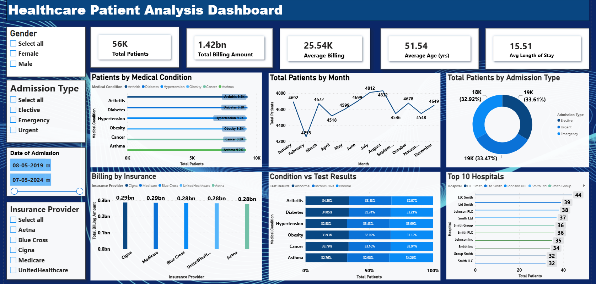

# 🏥 Healthcare Patient Analysis Dashboard (Power BI)

## 📋 Overview

An interactive Power BI dashboard analyzing patient data to uncover insights on billing, medical conditions, admissions, and hospital performance — helping healthcare administrators make data-driven decisions.

## 📸 Dashboard Preview

## 🛠️ Tools Used

- Power BI Desktop
- DAX (Data Analysis Expressions)

## 📁 Dataset

Healthcare patient dataset with 56,000 records, including demographics, medical conditions, admission details, billing, and insurance information.

## 🎯 Dashboard Features

- **5 KPI Cards:** Total Patients, Total Billing Amount, Average Billing, Average Age, Avg Length of Stay
- **6 Visuals:** Patients by Medical Condition, Total Patients by Month, Total Patients by Admission Type, Billing by Insurance, Condition vs Test Results, Top 10 Hospitals
- **4 Interactive Filters:** Gender, Admission Type, Date of Admission, Insurance Provider

## 🔑 Key Metrics

| Metric | Value |
| Total Patients | 56K |
| Total Billing Amount | ₹1.42bn |
| Average Billing | ₹25.54K |
| Average Age | 51.54 yrs |
| Avg Length of Stay | 15.51 days |

## 🔍 Key Insights

- **Arthritis** and **Diabetes** are the most common medical conditions (9.3K patients each)
- Patient admissions are fairly evenly distributed across **Elective, Urgent, and Emergency** types (~33% each)
- Monthly patient volume peaked in **July** (4,812 patients) and dipped lowest in **February** (4,255 patients)
- Billing amounts are fairly consistent across insurance providers (₹0.28bn–₹0.29bn each)
- Test results (Abnormal, Inconclusive, Normal) are evenly distributed across most medical conditions

## 📁 Files

- `healthcare_dataset.csv` — Raw dataset
- `Healthcare_Patient_Analysis_Dashboard.pbix` — Power BI packaged file (open in Power BI Desktop)
- `Healthcare_Patient_Analysis_Dashboard.png` — Dashboard screenshot

## 👤 Author

**Rosmi Cheriyan**  
Data Analytics Trainee | Aspiring Data Analyst / Power BI Developer  
🔗 [LinkedIn](https://linkedin.com/in/rosmicheriyan)
